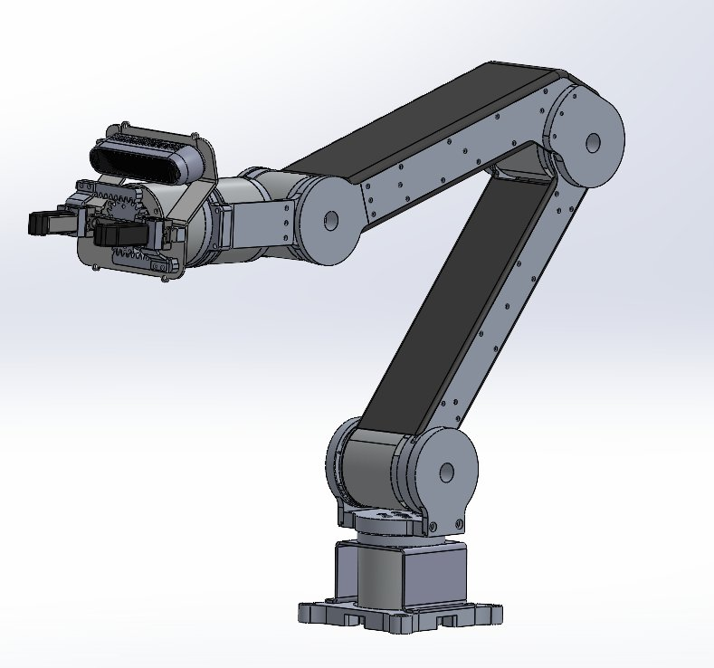
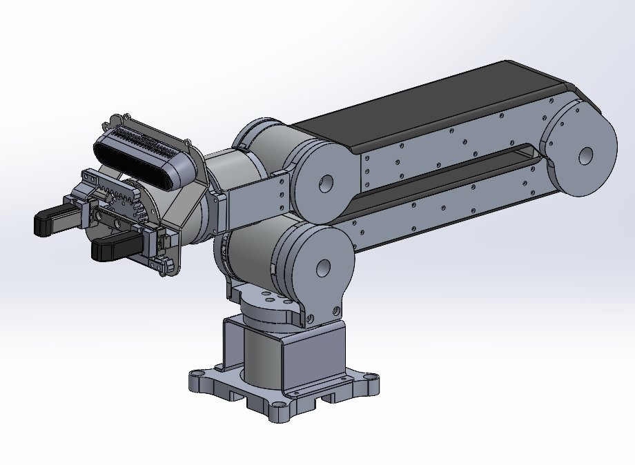
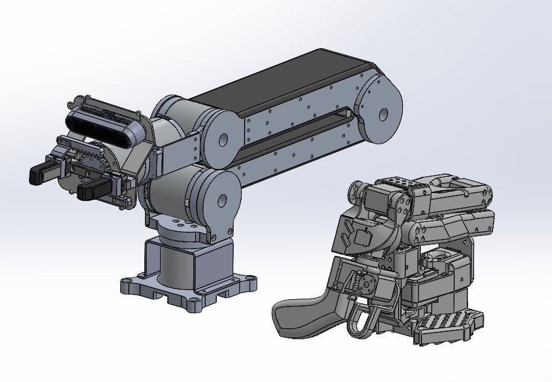

# 🦾 open-pquaca-arm

**Fully open low-cost 5-DOF robotic arm + gripper built for natural movement and versatile manipulation.**

[](LICENSE)
[](https://github.com/TheRobotStudio/SO-ARM100)
[]()

---

> *Pquaca* — "arm" in Muisca, the language of the pre-Columbian Chibcha civilization of the Colombian highlands.

---

## Overview

Open-Pquaca-Arm is a fully open-source 5-DOF robotic arm designed for low-cost embodied AI research and development. Built from sheet metal plates, CNC brackets, and 3D printed parts driven by Damiao quasi-direct-drive BLDC motors. Compatible with the SO-ARM100 teleoperation leader arm. Equipped with a custom 2-finger pinch gripper designed to emulate the human precision pinch grip.

Inspired by [SO-ARM100](https://github.com/TheRobotStudio/SO-ARM100) and [OpenArm](https://openarm.dev/).

<div align="center">
  
  <br><em>Open-Pquaca-Arm — 5-DOF full reach configuration.</em>
</div>

<div align="center">
  
  <br><em>Shoulder and elbow detail — sheet metal construction with QDD motor joints.</em>
</div>

<div align="center">
  
  <br><em>Arm and custom 2-finger pinch gripper.</em>
</div>

---

## Specifications

| Parameter | Value |
|---|---|
| DOF | 5 + 1 gripper |
| Payload | 1 kg |
| Max reach | 600 mm |
| Supply voltage | 24V DC |
| Construction | Sheet metal, CNC brackets, 3D printed parts |
| Teleoperation | Compatible with SO-ARM100 leader arm |

---

## Actuators

| Joint | Motor | Type |
|---|---|---|
| Shoulder roll | DM-J4340-2EC V2 | BLDC QDD, 24V |
| Shoulder pitch | DM-J4340-2EC V2 | BLDC QDD, 24V |
| Elbow | DM-J4340-2EC V2 | BLDC QDD, 24V |
| Wrist pitch | DM-J4310-2EC V1.1 | BLDC QDD, 24V |
| Wrist roll | DM-J4310-2EC V1.1 | BLDC QDD, 24V |
| Gripper | DM-J4310-2EC V1.1 | BLDC QDD, 24V |

All motors from [Damiao Technology](https://www.damiaokeji.com/).
Basic motor usage and API: [Damiao wiki](https://github.com/dmBots/DM_Motor_Tool).

---

## Gripper

Custom 2-finger pinch gripper designed to emulate the human precision pinch grip.
Optimized for grasping small objects and tools — pens, markers, small containers.
3D printed structure with direct motor drive.

---

## Repository Structure

```
open-pquaca-arm/
├── docs/
│   └── images/
└── README.md
```

---

## Status

| Component | Status |
|---|---|
| Mechanical design | ✅ Done |
| Motor selection + wiring | ✅ Done |
| BOM | 🚧 In progress |
| STEP files for manufacturing | 🚧 In progress |
| Assembly guide | 🚧 In progress |
| MuJoCo XML model | 🚧 In progress |
| URDF for Isaac Sim | 🚧 In progress |
| LeRobot integration | 🚧 In progress |
| ROS2 Humble + MoveIt | ⏳ Planned |

---

## Acknowledgements

Inspired by:
- [SO-ARM100](https://github.com/TheRobotStudio/SO-ARM100) — The Robot Studio
- [OpenArm](https://openarm.dev/)

Motor support:
- [Damiao Technology](https://wiki.seeedstudio.com/damiao_series/)

---

## Author

**Gilberto Galvis Giraldo**
M.Sc. Electrical and Computer Engineering — Sungkyunkwan University

---

## License

Apache License 2.0 — see [LICENSE](LICENSE) for details.
